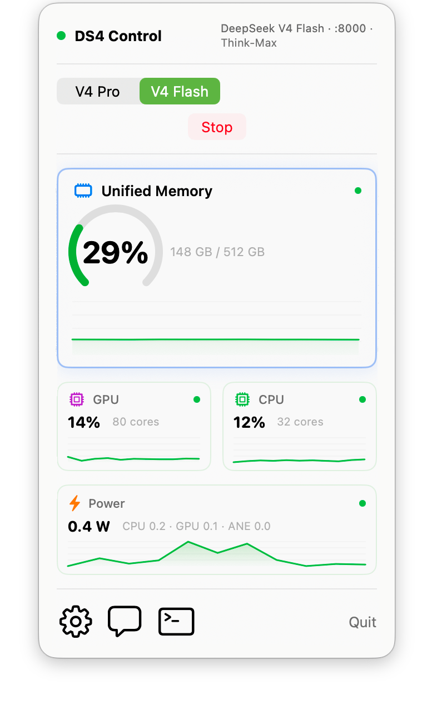

# DS4 Control

[](https://github.com/notatestuser/ds4-control/actions/workflows/ci.yml)

A macOS menu-bar control pane for **DeepSeek V4** via [`ds4`](https://github.com/antirez/ds4). It launches, supervises, and monitors a local `ds4-server`, lets you pick **V4 Pro** or **V4 Flash** with **1M context**, and shows mini resource-monitoring widgets right in the popup — so you can run a frontier local model without ever touching a terminal.

<br>

<p align="center">
  <picture>
    <source media="(prefers-color-scheme: dark)" srcset="docs/screenshot-dark-v8.png">
    
  </picture>
</p>

<p align="center">
  <a href="https://github.com/notatestuser/ds4-control/releases/latest">
    
  </a>
</p>

<p align="center">
  <b>Signed with a live Apple Developer ID &amp; notarized by Apple.</b>
</p>

## What it does

- **Start / stop / monitor** the local `ds4-server` child process — spawn, stderr readiness detection, health polling, graceful stop, and crash detection.
- **Pro / Flash selector** with a RAM-feasibility gate (Pro defaults on machines with ≥ 512 GiB unified memory).
- **Model downloads** via a built-in native parallel downloader, with a live progress bar (speed, MB, %) and resume across restarts.
- **Mini resource widgets**: unified memory (hero), GPU, power/ANE, and CPU, sampled on a 2 s timer.
- **Launch Chat** to talk to the model.
- **Launch Claude Code or Pi** to plan, write, maintain or refactor code.
- **1M Context** configurable in settings.

What it is **not**:

- No model search or registry browsing.
- No embedded inference — all inference is delegated to `ds4-server`.

## Dev quick start

1. **Build ds4** — clone and build [antirez/ds4](https://github.com/antirez/ds4) so you have the `ds4-server` binary.
2. **Build DS4 Control** — `bash build.sh`, then open `DS4 Control.app` (or `swift run` during development).
3. **Pick a model** — choose **Pro** or **Flash** (the app preselects based on your installed RAM).
4. **Start** — click **Start** (or **Download** first if the model isn't present yet).
5. Do things with DeepSeek.

## Requirements

- **Apple Silicon**
- You do **not** pre-download the model — DS4 Control downloads it for you with a built-in parallel downloader, resumable across restarts.
- **Auth (optional):** the model repository is public, so no token is required for normal use.
- **RAM** — see below.

## RAM feasibility

DeepSeek V4 is memory-hungry so DS4 Control gates feasibility before launching.

| Variant | Quant | RAM | Notes |
| --- | --- | --- | --- |
| V4 Pro | pro-imatrix | **≥ 512 GiB required** | Anything below is blocked. |
| V4 Flash | q4-imatrix | ≥ 256 GiB | Standard. |
| V4 Flash | q2-imatrix | 96 GiB minimum | 96–127 GiB requires raising the Metal wired limit (see below). |

On **96–127 GiB** machines you must raise the Metal wired limit so the GPU working set fits, e.g.:

```sh
sudo sysctl iogpu.wired_limit_mb=<~0.9 × RAM_MB>
```

DS4 Control shows the advisory value for your machine when this applies.

**Default context** scales with RAM: `1,000,000` on ≥ 512 GiB (Pro's full model context), up to `393216` ("Think-Max") on Flash with ≥ 128 GiB, and stepped down through a snap set (`393216 → 250000 → 131072 → 65536 → 32768`) for lower-RAM machines based on a weights-plus-KV memory budget. You can override the context in Settings.

## Performance

Measured single-stream generation throughput on a **Mac Studio M3 Ultra** (512 GiB):

| Model | Throughput |
|---|---|
| V4 Pro | **~14 tok/s** |
| V4 Flash | **~35 tok/s** |

Varies with context length, prompt, and the Metal wired limit.

## Build & Run

For development:

```sh
swift run
```

To produce a distributable bundle:

```sh
bash build.sh
```

This builds a release binary and assembles `DS4 Control.app`.

**First run:** open **Settings** (the gear in the popup) and set the **ds4 directory** — the folder that contains `ds4-server`.

## Signing

`build.sh` auto-detects your **Apple Development** identity via `security find-identity` and signs the bundle with it. If no Apple Development identity is installed, it falls back to **ad-hoc** signing (the app runs locally but is not distributable).

To sign with your own key:

- Install an Apple Development certificate (Xcode → Settings → Accounts → Manage Certificates → **+** → Apple Development), **or**
- Set `DS4_SIGN_IDENTITY="Apple Development: …"` before running `build.sh`.

## How it works

DS4 Control is a single Swift binary — no embedded inference and no second process language. Three `@MainActor` objects do the work, and the SwiftUI layer just observes them:

- **`SupervisorService`** owns the `ds4-server` lifecycle through `Foundation.Process`: it builds the launch arguments, watches stderr for the `listening on http://` readiness line, polls `GET /v1/models` for health, and stops gracefully with SIGTERM (SIGKILL fallback). Model weights are fetched by a built-in native parallel downloader (resumable across restarts).
- **`MetricsManager`** samples CPU, memory, GPU, and power/ANE via Mach, IOKit, and the private IOReport interface every 2 s, publishing a `SystemSnapshot` to the widgets.
- **`Feasibility`** turns installed RAM into a variant choice and a budget-derived default context (pure, fully unit-tested).

The pieces with real logic — the feasibility/context math, the readiness parser, the resumable chunk/bitmap downloader, and the supervisor state machine — are pure and covered by tests. The supervisor is exercised end-to-end against a fake `ds4-server` and an injected download, so the full lifecycle is tested without downloading a multi-hundred-gigabyte model.

## Testing / QA

```sh
swift test
```

Tests cover the pure logic (variant/feasibility/context math, readiness parser, chunk-bitmap resume) plus model-free integration of the supervisor via a fake `ds4-server` and an injected download. No real model is needed.

CI (GitHub Actions, `macos-26`) runs, on every pull request:

- `swift format` lint (strict),
- a release build with warnings treated as errors,
- the test suite,
- a bundle smoke build (`build.sh`, ad-hoc signed in CI).

## Attribution

- The resource collectors and widgets are adapted from **mac-resource-monitor**, which in turn credits **[macmon](https://github.com/vladkens/macmon)** (MIT) for the IOReport power-sampling approach.
- The server-supervision pattern is built on the lineage of **mlx-serve**.

## License

MIT — see [LICENSE](LICENSE).
