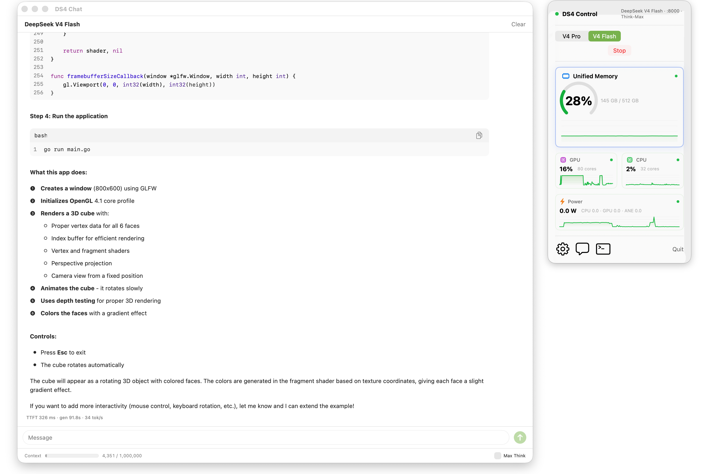

# DS4 Control

[](https://github.com/notatestuser/ds4-control/actions/workflows/ci.yml)

A macOS menu-bar control pane for **DeepSeek V4** via [`ds4`](https://github.com/antirez/ds4). It launches, supervises, and monitors a local `ds4-server`, lets you pick **V4 Pro** or **V4 Flash**, and shows mini resource-monitoring widgets right in the popup — so you can run a frontier local model without ever touching a terminal.

<br>

<p align="center">
  <a href="https://github.com/notatestuser/ds4-control/releases/latest/download/DS4-Control-v1.0.0.dmg">
    
  </a>
</p>

<p align="center">
  <b>Signed with a live Apple Developer ID &amp; notarized by Apple.</b><br>
  The <code>.dmg</code> passes Gatekeeper cleanly — no “unidentified developer” warning and no right-click&nbsp;→&nbsp;Open workaround. macOS&nbsp;15+ · Apple&nbsp;silicon.<br>
  <sub><a href="https://github.com/notatestuser/ds4-control/releases/latest">All releases</a> · direct link: <code>DS4-Control-v1.0.0.dmg</code></sub>
</p>

<br>

<picture>
  <source media="(prefers-color-scheme: dark)" srcset="docs/screenshot-dark-v3.png">
  
</picture>

## What it does

- **Start / stop / monitor** the local `ds4-server` child process — spawn, stderr readiness detection, health polling, graceful stop, and crash detection.
- **Pro / Flash selector** with a RAM-feasibility gate (Pro defaults on machines with ≥ 512 GiB unified memory).
- **Model downloads** delegated to ds4's `download_model.sh`, with a live progress bar parsed from the downloader's output (`hf`/tqdm or `curl`).
- **Mini resource widgets**: unified memory (hero), GPU, power/ANE, and CPU, sampled on a 2 s timer.

What it is **not**:

- No model search or registry browsing.
- No embedded inference — all inference is delegated to `ds4-server`. This app only supervises the process and surfaces system metrics.

## Screenshot

## Quick start

1. **Build ds4** — clone and build [antirez/ds4](https://github.com/antirez/ds4) so you have the `ds4-server` binary and `download_model.sh`.
2. **Build DS4 Control** — `bash build.sh`, then open `DS4 Control.app` (or `swift run` during development).
3. **Point it at ds4** — click the menu-bar icon → the gear → set the **ds4 directory** to your ds4 checkout.
4. **Pick a model** — choose **Pro** or **Flash** (the app preselects based on your installed RAM).
5. **Start** — click **Start** (or **Download** first if the model isn't present yet). Watch the icon go orange → green and unified memory climb as the model loads — no terminal required.

## Requirements

- **Apple Silicon**
- You do **not** pre-download the model — DS4 Control downloads it for you via ds4's `download_model.sh`.
- **HuggingFace Xet:** the model GGUFs are served from HF's Xet storage, which a plain-`curl` downloader can't fetch (HTTP 400). `download_model.sh` must use the `hf` CLI (`pip install -U huggingface_hub`); the app parses progress from either `hf`/tqdm or `curl` output.
- **Auth (optional):** the repo is public, so no token is required. If a token is present in the `HF_TOKEN` environment variable or the local hf cache (`hf auth login`), the app forwards it to the downloader **via the environment** (never `--token`, so it can't leak in `ps`). Authenticating can help avoid anonymous rate-limits/throttling.

## RAM feasibility

DeepSeek V4 is memory-hungry, and `ds4-server` enforces no RAM floor itself — so DS4 Control gates feasibility before launching.

| Variant | Quant | RAM | Notes |
| --- | --- | --- | --- |
| V4 Pro | pro-imatrix | **≥ 512 GiB required** | Anything below is blocked. |
| V4 Flash | q4-imatrix | ≥ 256 GiB | Standard. |
| V4 Flash | q2-imatrix | **128 GiB recommended**, 96 GiB minimum | 96–127 GiB requires raising the Metal wired limit (see below). |
| V4 Flash | — | **< 96 GiB unsupported** | Hidden behind an opt-in "unsupported low-RAM mode" toggle; may swap or crash. Not usable for real generation. |

On **96–127 GiB** machines you must raise the Metal wired limit so the GPU working set fits, e.g.:

```sh
sudo sysctl iogpu.wired_limit_mb=<~0.9 × RAM_MB>
```

DS4 Control shows the advisory value for your machine when this applies.

**Default context** scales with RAM: `1,000,000` on ≥ 512 GiB (Pro's full model context), up to `393216` ("Think-Max") on Flash with ≥ 128 GiB, and stepped down through a snap set (`393216 → 250000 → 131072 → 65536 → 32768`) for lower-RAM machines based on a weights-plus-KV memory budget. You can override the context in Settings.

## Performance

Measured single-stream generation throughput on a **Mac Studio M3 Ultra** (512 GiB):

| Model | Throughput |
|---|---|
| V4 Pro | **~14 tok/s** |
| V4 Flash | **~35 tok/s** |

Varies with context length, prompt, and the Metal wired limit.

## Build & Run

For development:

```sh
swift run
```

To produce a distributable bundle:

```sh
bash build.sh
```

This builds a release binary and assembles `DS4 Control.app`.

**First run:** open **Settings** (the gear in the popup) and set the **ds4 directory** — the folder that contains `ds4-server` and `download_model.sh`.

## Signing

`build.sh` auto-detects your **Apple Development** identity via `security find-identity` and signs the bundle with it. If no Apple Development identity is installed, it falls back to **ad-hoc** signing (the app runs locally but is not distributable).

To sign with your own key:

- Install an Apple Development certificate (Xcode → Settings → Accounts → Manage Certificates → **+** → Apple Development), **or**
- Set `DS4_SIGN_IDENTITY="Apple Development: …"` before running `build.sh`.

There is no notarization in v1.

## Known limitations

1. Changing the **ds4 directory** in Settings takes effect on the next launch.
2. Power sampling briefly blocks the main thread (~100 ms every 2 s) on Apple Silicon — imperceptible in normal use. An off-main refactor is planned.
3. No app icon yet; the menu-bar glyph is an SF Symbol.
4. ds4 enforces no RAM floor itself — DS4 Control is what gates feasibility.

## How it works

DS4 Control is a single Swift binary — no embedded inference and no second process language. Three `@MainActor` objects do the work, and the SwiftUI layer just observes them:

- **`SupervisorService`** owns the `ds4-server` lifecycle through `Foundation.Process`: it builds the launch arguments, watches stderr for the `listening on http://` readiness line, polls `GET /v1/models` for health, and stops gracefully with SIGTERM (SIGKILL fallback). Model downloads shell out to ds4's `download_model.sh` with live `curl` progress.
- **`MetricsManager`** samples CPU, memory, GPU, and power/ANE via Mach, IOKit, and the private IOReport interface every 2 s, publishing a `SystemSnapshot` to the widgets.
- **`Feasibility`** turns installed RAM into a variant choice and a budget-derived default context (pure, fully unit-tested).

The pieces with real logic — the feasibility/context math, the readiness and `curl`-progress parsers, and the supervisor state machine — are pure and covered by tests. The supervisor is exercised end-to-end against a fake `ds4-server` and a fake `download_model.sh`, so the full lifecycle is tested without downloading a multi-hundred-gigabyte model.

## Testing / QA

```sh
swift test
```

Tests cover the pure logic (variant/feasibility/context math, readiness and curl-progress parsers) plus model-free integration of the supervisor via a fake `ds4-server` and a fake `download_model.sh`. No real model is needed.

CI (GitHub Actions, `macos-26`) runs, on every pull request:

- `swift format` lint (strict),
- a release build with warnings treated as errors,
- the test suite,
- a bundle smoke build (`build.sh`, ad-hoc signed in CI).

## Attribution

- The resource collectors and widgets are adapted from **mac-resource-monitor**, which in turn credits **[macmon](https://github.com/vladkens/macmon)** (MIT) for the IOReport power-sampling approach.
- The server-supervision pattern is built on the lineage of **mlx-serve**.

## License

MIT — see [LICENSE](LICENSE).
